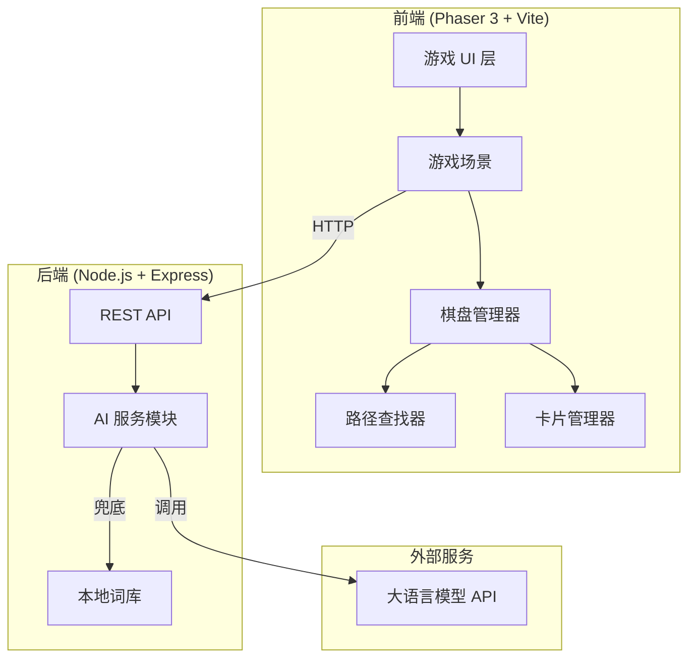

# Design Document

## Overview

智连词境是一个基于 Phaser 3 的网页端词语连连看游戏，结合 AI 服务提供动态内容生成和智能教学反馈。系统采用前后端分离架构，前端负责游戏渲染和交互，后端提供 AI 内容生成 API。

**技术栈：**
- 前端：Phaser 3 + TypeScript + Vite
- 后端：Node.js + Express + TypeScript
- AI：大语言模型 API（支持 OpenAI/Claude/国产模型）

## Architecture



**架构特点：**
1. 前后端解耦，通过 REST API 通信
2. AI 模块独立，支持替换不同模型
3. 本地词库兜底，确保离线可用
4. 游戏逻辑与渲染分离

## Components and Interfaces

### 前端组件

#### 1. GameScene（游戏主场景）
```typescript
interface GameScene {
  // 初始化游戏
  init(config: GameConfig): void
  // 开始新游戏
  startGame(): Promise<void>
  // 处理卡片点击
  handleCardClick(card: CardSprite): void
  // 结束游戏
  endGame(): void
}
```

#### 2. BoardManager（棋盘管理器）
```typescript
interface BoardManager {
  // 初始化棋盘
  initBoard(rows: number, cols: number, cards: WordCard[]): void
  // 获取指定位置的卡片
  getCardAt(row: number, col: number): WordCard | null
  // 移除卡片
  removeCard(row: number, col: number): void
  // 检查游戏是否完成
  isGameComplete(): boolean
  // 获取当前棋盘状态
  getBoardState(): BoardState
}
```

#### 3. PathFinder（路径查找器）
```typescript
interface PathFinder {
  // 查找两点之间的有效路径（≤2拐点）
  findPath(start: Position, end: Position, board: BoardState): Path | null
  // 检查路径是否有效
  isValidPath(path: Path): boolean
}

interface Path {
  points: Position[]
  turns: number
}

interface Position {
  row: number
  col: number
}
```

#### 4. CardManager（卡片管理器）
```typescript
interface CardManager {
  // 创建卡片精灵
  createCardSprite(card: WordCard, position: Position): CardSprite
  // 选中卡片
  selectCard(card: CardSprite): void
  // 取消选中
  deselectCard(card: CardSprite): void
  // 移除卡片动画
  removeCardsWithAnimation(card1: CardSprite, card2: CardSprite, path: Path): Promise<void>
}
```

### 后端组件

#### 1. WordController（词语控制器）
```typescript
interface WordController {
  // 生成词语关卡
  generateWords(req: GenerateRequest): Promise<WordCard[]>
  // 获取 AI 解释
  getExplanation(word: string, meaning: string): Promise<string>
  // 获取学习总结
  getSummary(gameResult: GameResult): Promise<string>
}
```

#### 2. AIService（AI 服务）
```typescript
interface AIService {
  // 生成词语内容
  generateContent(params: GenerateParams): Promise<WordCard[]>
  // 生成解释
  generateExplanation(word: string, meaning: string, isCorrect: boolean): Promise<string>
  // 生成学习总结
  generateSummary(stats: GameStats): Promise<string>
}
```

#### 3. LocalWordBank（本地词库）
```typescript
interface LocalWordBank {
  // 获取词语列表
  getWords(language: Language, level: Level, theme: Theme, count: number): WordCard[]
}
```

## Data Models

### WordCard（词卡）
```typescript
interface WordCard {
  id: string
  word: string           // 词语/单词
  meaning: string        // 释义
  hint: string           // 学习提示
  confuse?: string       // 易混淆词
  type: 'word' | 'meaning'  // 卡片类型
  pairId: string         // 配对 ID
}
```

### GameConfig（游戏配置）
```typescript
interface GameConfig {
  language: 'zh' | 'en'
  level: 'easy' | 'medium' | 'hard'
  theme: string
  boardSize: {
    rows: number
    cols: number
  }
}
```

### BoardState（棋盘状态）
```typescript
interface BoardState {
  grid: (WordCard | null)[][]
  rows: number
  cols: number
}
```

### GameState（游戏状态）
```typescript
interface GameState {
  config: GameConfig
  board: BoardState
  score: {
    correct: number
    wrong: number
  }
  elapsedTime: number
  selectedCard: Position | null
  isComplete: boolean
}
```

### GameResult（游戏结果）
```typescript
interface GameResult {
  correct: number
  wrong: number
  duration: number
  matchHistory: MatchRecord[]
}

interface MatchRecord {
  word: string
  meaning: string
  isCorrect: boolean
  timestamp: number
}
```

### API 请求/响应

#### 生成词语请求
```typescript
interface GenerateRequest {
  language: 'zh' | 'en'
  level: 'easy' | 'medium' | 'hard'
  theme: string
  count: number
}
```

#### 生成词语响应
```typescript
interface GenerateResponse {
  success: boolean
  data: WordCard[]
  source: 'ai' | 'local'  // 标识数据来源
}
```


## Correctness Properties

*A property is a characteristic or behavior that should hold true across all valid executions of a system-essentially, a formal statement about what the system should do. Properties serve as the bridge between human-readable specifications and machine-verifiable correctness guarantees.*

### Property 1: Difficulty-to-Board-Size Mapping
*For any* difficulty level selection, the system should return the correct board dimensions: easy → 4×4, medium → 6×6, hard → 8×8.
**Validates: Requirements 1.3**

### Property 2: Board Dimensions Match Configuration
*For any* game configuration, the generated board should have exactly the number of rows and columns specified by the difficulty level.
**Validates: Requirements 2.1**

### Property 3: Card Pairing Completeness
*For any* generated board, every WordCard should have exactly one matching pair on the board (same pairId, opposite type).
**Validates: Requirements 2.2**

### Property 4: Match Evaluation Correctness
*For any* two selected cards, the match evaluation should return true if and only if they share the same pairId and have different types (word vs meaning).
**Validates: Requirements 2.4, 4.1, 4.2**

### Property 5: Path Finding Correctness
*For any* two positions on a board, if a valid path exists with ≤2 turns, the PathFinder should find it; if no such path exists, it should return null.
**Validates: Requirements 3.2, 3.3, 3.4, 3.5**

### Property 6: Match Failure Distinction
*For any* failed match attempt, the system should correctly distinguish between "invalid path" (no valid connection) and "content mismatch" (cards don't match).
**Validates: Requirements 4.5**

### Property 7: WordCard Structure Validity
*For any* WordCard returned by the system (from AI or local), it should contain all required fields: id, word, meaning, hint, type, and pairId.
**Validates: Requirements 5.2, 8.5**

### Property 8: Pair Count Matches Board Size
*For any* board configuration, the number of word pairs generated should equal exactly half the total cells (rows × cols / 2).
**Validates: Requirements 5.4**

### Property 9: Game Statistics Accuracy
*For any* completed game, the statistics (correct count, wrong count, duration) should accurately reflect the actual match history.
**Validates: Requirements 6.2**

### Property 10: Difficulty Adjustment Triggers
*For any* sequence of match results, difficulty adjustments should trigger correctly: 3 consecutive correct → increase difficulty, 3 consecutive wrong → decrease difficulty.
**Validates: Requirements 7.1, 7.2**

### Property 11: API Parameter Validation
*For any* word generation request, the API should accept and correctly process valid language, level, and theme parameters.
**Validates: Requirements 8.1**

### Property 12: JSON Response Parsing
*For any* valid JSON response from AI, the parser should correctly extract WordCard array; for invalid JSON, it should throw a parse error.
**Validates: Requirements 8.3**

### Property 13: Game State Serialization Round-Trip
*For any* valid GameState, serializing to JSON and then deserializing should produce an equivalent GameState with all properties preserved.
**Validates: Requirements 9.5**

## Error Handling

### 前端错误处理

| 错误场景 | 处理策略 |
|---------|---------|
| API 请求超时 | 显示加载失败提示，提供重试按钮 |
| AI 服务不可用 | 自动切换到本地词库，显示提示 |
| 无效的游戏状态 | 重置游戏，显示错误信息 |
| 路径计算失败 | 显示"无法连接"提示 |

### 后端错误处理

| 错误场景 | 处理策略 |
|---------|---------|
| AI API 调用失败 | 重试一次，失败后返回本地词库数据 |
| 无效请求参数 | 返回 400 错误，包含具体错误信息 |
| JSON 解析失败 | 记录日志，返回本地词库数据 |
| 本地词库不足 | 返回可用数据，标记数量不足 |

### 错误响应格式
```typescript
interface ErrorResponse {
  success: false
  error: {
    code: string
    message: string
    details?: any
  }
}
```

## Testing Strategy

### 测试框架选择
- 单元测试：Vitest（与 Vite 集成良好）
- 属性测试：fast-check（TypeScript 原生支持的 PBT 库）

### 单元测试覆盖

1. **PathFinder 测试**
   - 直线路径检测
   - 单拐点路径检测
   - 双拐点路径检测
   - 无效路径拒绝

2. **BoardManager 测试**
   - 棋盘初始化
   - 卡片移除
   - 游戏完成检测

3. **Match 逻辑测试**
   - 正确匹配识别
   - 错误匹配识别
   - 路径失败与内容失败区分

4. **序列化测试**
   - GameState 序列化
   - GameState 反序列化
   - 无效数据处理

### 属性测试要求

每个属性测试必须：
- 运行至少 100 次迭代
- 使用注释标记对应的正确性属性
- 格式：`**Feature: ai-word-connect-game, Property {number}: {property_text}**`

### 属性测试覆盖

| 属性 | 测试策略 |
|-----|---------|
| Property 1 | 生成所有难度级别，验证返回的棋盘尺寸 |
| Property 2 | 生成随机配置，验证棋盘维度 |
| Property 3 | 生成随机棋盘，验证每张卡都有配对 |
| Property 4 | 生成随机卡片对，验证匹配逻辑 |
| Property 5 | 生成随机棋盘和位置，验证路径查找 |
| Property 6 | 生成各种失败场景，验证错误类型区分 |
| Property 7 | 生成随机 WordCard，验证结构完整性 |
| Property 8 | 生成随机棋盘尺寸，验证配对数量 |
| Property 9 | 生成随机游戏历史，验证统计计算 |
| Property 10 | 生成随机匹配序列，验证难度调整触发 |
| Property 11 | 生成随机 API 参数，验证参数处理 |
| Property 12 | 生成随机 JSON 响应，验证解析逻辑 |
| Property 13 | 生成随机 GameState，验证序列化往返 |

## 目录结构

```
ai-word-connect-game/
├── client/                    # 前端代码
│   ├── src/
│   │   ├── main.ts           # 入口文件
│   │   ├── config/           # 游戏配置
│   │   ├── scenes/           # Phaser 场景
│   │   │   ├── BootScene.ts
│   │   │   ├── MenuScene.ts
│   │   │   └── GameScene.ts
│   │   ├── managers/         # 管理器
│   │   │   ├── BoardManager.ts
│   │   │   ├── CardManager.ts
│   │   │   └── PathFinder.ts
│   │   ├── models/           # 数据模型
│   │   │   └── types.ts
│   │   ├── services/         # API 服务
│   │   │   └── ApiService.ts
│   │   └── utils/            # 工具函数
│   │       └── serialization.ts
│   ├── index.html
│   ├── package.json
│   └── vite.config.ts
├── server/                    # 后端代码
│   ├── src/
│   │   ├── index.ts          # 入口文件
│   │   ├── routes/           # 路由
│   │   │   └── words.ts
│   │   ├── services/         # 服务
│   │   │   ├── AIService.ts
│   │   │   └── LocalWordBank.ts
│   │   ├── models/           # 数据模型
│   │   │   └── types.ts
│   │   └── data/             # 本地词库
│   │       ├── zh-idioms.json
│   │       └── en-words.json
│   ├── package.json
│   └── tsconfig.json
├── shared/                    # 共享类型
│   └── types.ts
└── package.json              # 根 package.json
```
